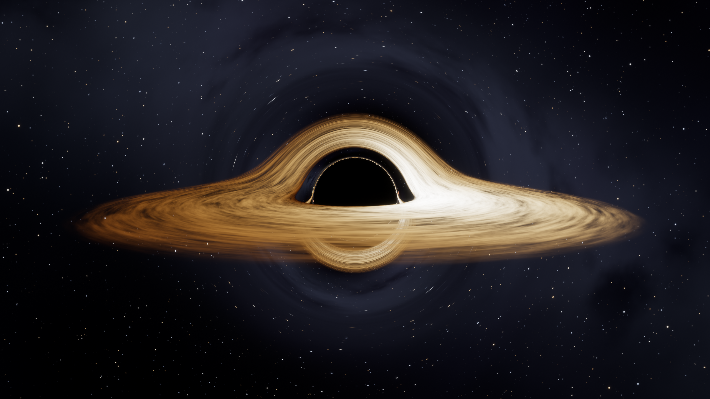

# **black**_**hole** — enhanced renderer fork

🇧🇷 [Leia em Português](README.pt-BR.md)


<sub>BlackHole3D_GPU, 2560x1440 render.</sub>

Fork of [kavan010/black_hole](https://github.com/kavan010/black_hole) by **SKELLETONX**, with a rewritten GPU renderer for the 3D simulation (`black_hole.cpp` + `geodesic.comp`).

### What's new
- **Full-resolution real-time ray tracing** — photon geodesics in Schwarzschild spacetime integrated with adaptive RK4 (was 200x150).
- **Physically based accretion disk** — blackbody color from a Novikov–Thorne temperature profile, relativistic Doppler beaming, gravitational redshift and animated turbulent gas with Keplerian differential rotation.
- **Gravitationally lensed sky** — procedural starfield, Milky Way band and nebulae.
- **HDR pipeline** — bloom from the mip chain, ACES filmic tone mapping, vignette.
- **Live control panel** ([Dear ImGui](https://github.com/ocornut/imgui)) for disk, sky, camera, post-processing and quality settings.
- Smooth orbit camera, auto orbit, PNG screenshots.

### Quick build (Windows, no vcpkg needed)
Requires Visual Studio 2022+ or Build Tools with the C++ workload. Run:

```
build_gpu.bat
```

It downloads GLFW, GLEW, GLM, Dear ImGui and stb into `deps/` on first run and produces `build_gpu\BlackHole3D_GPU.exe` (run it from inside `build_gpu`, next to the shader files).

### Controls
| Input | Action |
|---|---|
| Left drag | Orbit camera |
| Scroll | Zoom |
| H | Show / hide UI |
| Space | Toggle auto orbit |
| P | Save screenshot (PNG) |
| M | Mute / unmute music |
| G / right mouse | Toggle / hold N-body gravity |
| Esc | Quit |

### Background music
Put a file named `music.mp3` (or `music.wav` / `music.flac`) in the project folder before running `build_gpu.bat`, or directly next to `BlackHole3D_GPU.exe`. It plays in a loop with a fade-in when the app opens, and the UI has volume and mute controls. No music ships with the repo, and music files are git-ignored, so use a track you have the rights to.

Command line (renders one frame offscreen and exits; the size is not limited by your monitor):

```
BlackHole3D_GPU.exe --screenshot out.png --width 2560 --height 1440 --az 30 --elev 10 --dist 20
```

---

## Original README

Black hole simulation project

Here is the black hole raw code, everything will be inside a src bin incase you want to copy the files

I'm writing this as I'm beginning this project (hopefully I complete it ;D) here is what I plan to do:

1. Ray-tracing : add ray tracing to the gravity simulation to simulate gravitational lensing

2. Accretion disk : simulate accreciate disk using the ray tracing + the halos

3. Spacetime curvature : demonstrate visually the "trapdoor in spacetime" that is black holes using spacetime grid

4. [optional] try to make it run realtime ;D

I hope it works :/

Edit: After completion of project -

## **Building Requirements:**

1. C++ Compiler supporting C++ 17 or newer

2. [Cmake](https://cmake.org/)

3. [Vcpkg](https://vcpkg.io/en/)

4. [Git](https://git-scm.com/)

## **Build Instructions:**

1. Clone the repository:
	-  `git clone https://github.com/kavan010/black_hole.git`
2. CD into the newly cloned directory
	- `cd ./black_hole` 
3. Install dependencies with Vcpkg
	- `vcpkg install`
4. Get the vcpkg cmake toolchain file path
	- `vcpkg integrate install`
	- This will output something like : `CMake projects should use: "-DCMAKE_TOOLCHAIN_FILE=/path/to/vcpkg/scripts/buildsystems/vcpkg.cmake"`
5. Create a build directory
	- `mkdir build`
6. Configure project with CMake
	-  `cmake -B build -S . -DCMAKE_TOOLCHAIN_FILE=/path/to/vcpkg/scripts/buildsystems/vcpkg.cmake`
	- Use the vcpkg cmake toolchain path from above
7. Build the project
	- `cmake --build build`
8. Run the program
	- The executables will be located in the build folder

### Alternative: Debian/Ubuntu apt workaround

If you don't want to use vcpkg, or you just need a quick way to install the native development packages on Debian/Ubuntu, install these packages and then run the normal CMake steps above:

```bash
sudo apt update
sudo apt install build-essential cmake \
	libglew-dev libglfw3-dev libglm-dev libgl1-mesa-dev
```

This provides the GLEW, GLFW, GLM and OpenGL development files so `find_package(...)` calls in `CMakeLists.txt` can locate the libraries. After installing, run the `cmake -B build -S .` and `cmake --build build` commands as shown in the Build Instructions.

## **How the code works:**
for 2D: simple, just run 2D_lensing.cpp with the nessesary dependencies installed.

for 3D: black_hole.cpp and geodesic.comp work together to run the simuation faster using GPU, essentially it sends over a UBO and geodesic.comp runs heavy calculations using that data.

should work with nessesary dependencies installed, however I have only run it on windows with my GPU so am not sure!

LMK if you would like an in-depth explanation of how the code works aswell :)
